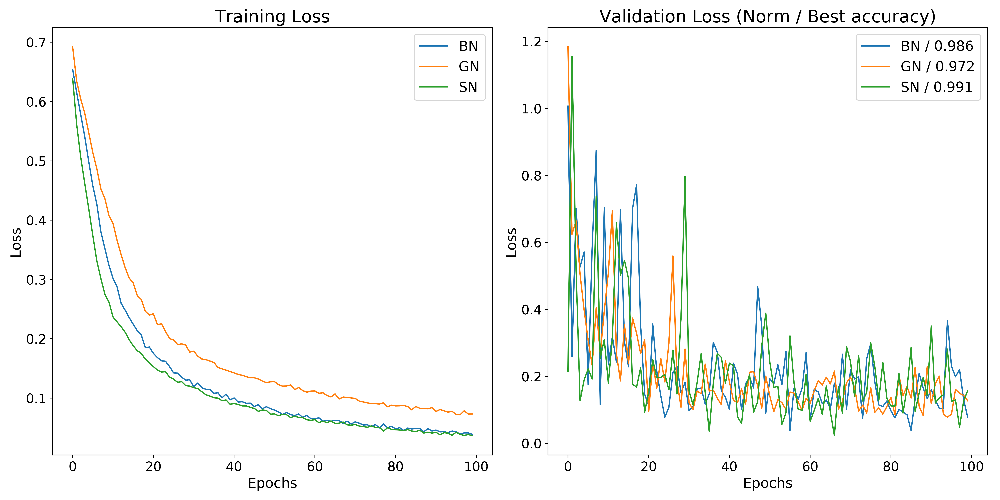

# ResNet_version

This repo is to compare the performance of ResNet-50-V1 and ResNet-50-V2 on Kaggle Cat/Dog Classification. 

Data is located on DGX-staion: /home/jimmy15923/benchmarks/cat_dog/sample

ResNet graph is written in tf.keras. Run your experiments by

```
python train_resnet.py --keras=v1 --batch_size=32 --norm=bn --name=test --gpu_id=1

--keras: ResNet version to use. keras / v1 / v2
--batch_size: Batch size
--epochs: Number of epochs
--norm: Which normalization to use. bn / gn / sn
--name: Name of the history.csv to save in logs/
--gpu_id: Which GPU
--gpu_fraction: GPU memory fraction
--optimizer: Adam or SGD. default=Adam
```

---
## Experiments

### We compare the performance with different version of ResNet-50 trained from scratch. 
The result shows that loss of v2 is unstable but more accurate than v1 

Hyper-parameter setting ares
- batch_size=32
- optimizer=Adam(lr=1e-4)
- batch normalization
- same augmentation
- epochs=100

**Adam Optimizer**


### We compare the performance with differenet normalization (BN/GN/SN) of same model on SGD/ADAM optimizer.
The result shows that loss of SN is lower than other normalization but more bumpy.

Hyper-parameter setting ares
- batch_size=32
- optimizer=Adam(lr=1e-4) / SGD(lr=1e-4, momentum=0.9, nestrov=True)
- same augmentation
- epochs=100

**ADAM Optimizer for BN/GN/SG**


**SGD Optimizer for BN/GN/SG**


